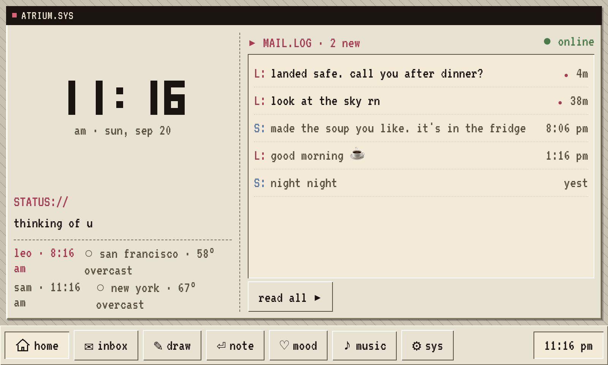
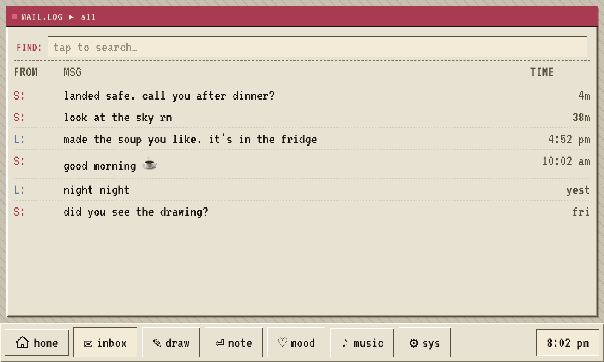
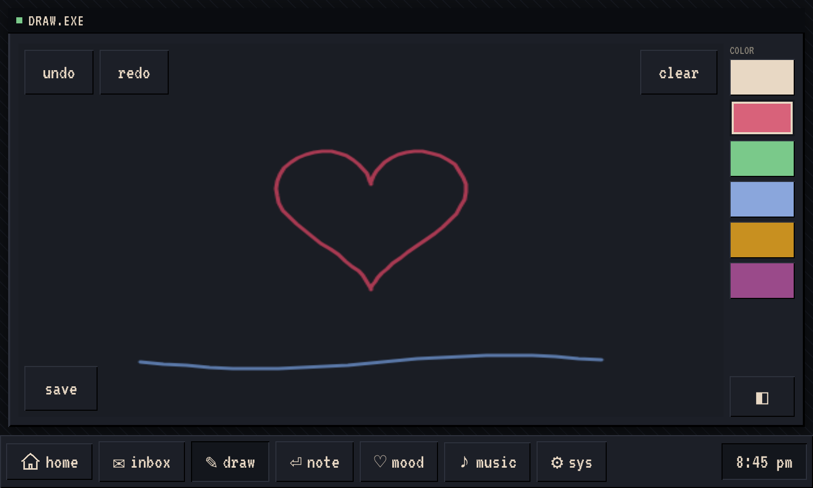
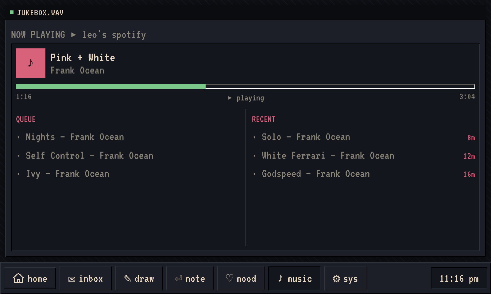
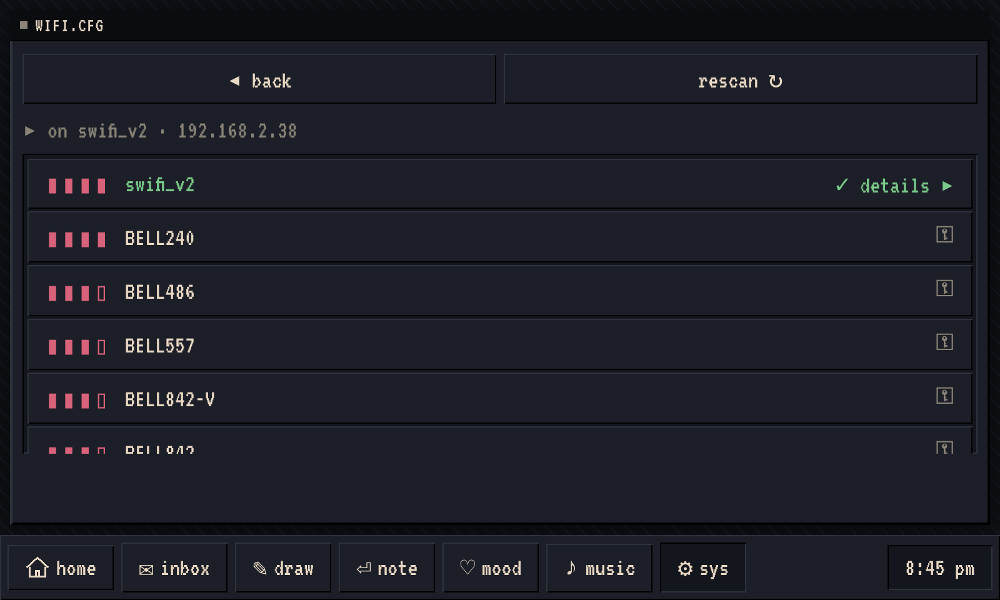
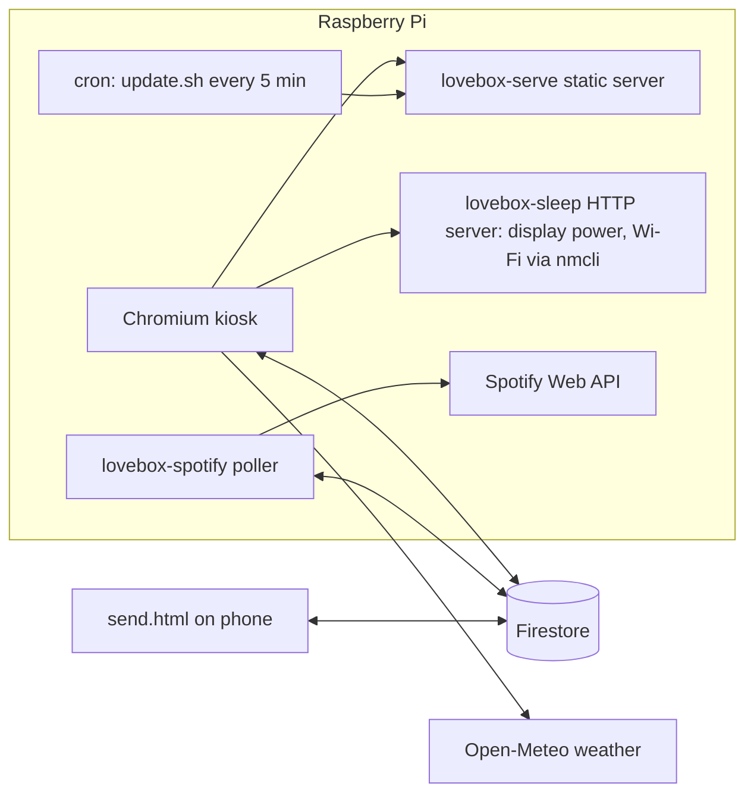

# lovebox

A dedicated, always-on device for a long-distance relationship. A Raspberry Pi drives a 5-inch touchscreen running a fullscreen web app styled like a retro terminal OS. One partner sends messages, doodles, moods, and songs from a phone-friendly web page; the other sees them arrive in realtime on the box sitting on their desk.



## What it does

| Module | Title bar | What it shows |
|---|---|---|
| home | `ATRIUM.SYS` | Pixel clock, partner's current status, live weather for both cities, unread mail preview |
| inbox | `MAIL.LOG` | Full message history with on-screen search |
| draw | `DRAW.EXE` | Shared canvas synced stroke-by-stroke, with undo, redo, palette, and a gallery of saved drawings |
| note | `NOTE.TXT` | Compose and send text using a custom on-screen keyboard |
| mood | `MOOD.CFG` | Six ASCII moods plus free-text custom status, broadcast to the partner's home screen |
| music | `JUKEBOX.WAV` | Partner's Spotify now-playing with interpolated progress, queue, and recent tracks |
| sys | `SYSTEM.CFG` | Light and dark theme, display sleep, Wi-Fi scan and connect from the touchscreen |

Everything is plain JavaScript and CSS with no framework. The UI is rendered with a small `el()` helper and a single `render()` pass per screen, which keeps it responsive on a Pi 3B+.

## Screens

### Inbox

Messages arrive over a Firestore subscription. Unread messages are marked when the inbox is opened, and a toast slides in from the taskbar when a new one lands while another module is active.



### Draw

Every stroke is written to Firestore as its own document, so both sides see the canvas update live. Undo removes your own latest stroke, redo replays it, and save snapshots the canvas to a gallery.



### Note

Text entry goes through a custom touch keyboard (`src/keyboard.js`) sized for the 800x480 panel, with shift, numbers, and a submit action bound per screen.


### Mood

Tap a mood or type a custom status. The latest status doc becomes the partner's `STATUS://` line on their home screen.


### Music

A service on the Pi polls both Spotify accounts and mirrors playback state into Firestore. The client interpolates the progress bar between polls so it moves smoothly. From the sender page the remote partner can push a track into the box's queue or force-play it.



### System and Wi-Fi

Theme toggle, display sleep, and a Wi-Fi panel that scans, connects with a password typed on the on-screen keyboard, and manages autoconnect. Off the Pi, the Wi-Fi client falls back to a mock so the UI is still testable.




### Dark theme

Every module has a dark variant driven by CSS custom properties on `[data-theme="dark"]`.


### Sender page

`send.html` is a standalone page for the remote partner. It signs in with Firebase Auth and offers message, canvas, mood, Spotify queue control, and a location field that feeds the box's weather.


## Architecture



- **Client** (`src/`): Vite-built vanilla JS. `firebase.js` owns every Firestore subscription and write. `main.js` holds state and the per-module renderers. `wifi.js` talks to the Pi's local HTTP server with a mock fallback.
- **Realtime backend**: Firebase Auth with two fixed accounts. Firestore security rules restrict reads and writes to those two UIDs and force each user to write only under their own identity. The `playback` collection is read-only for clients and written by the Pi's Admin SDK.
- **Pi services** (`pi/`): four systemd units. A static server for the built app, the Chromium kiosk, a root-level Python server for display sleep, wake-on-touch, and Wi-Fi management, and a Node Spotify service. A cron job pulls `main`, rebuilds, and restarts only the services whose files changed.

### Firestore collections

| Collection | Fields |
|---|---|
| `messages` | `text, from, timestamp, read, type, imageUrl?` |
| `status` | `mood, from, timestamp, custom?` |
| `canvas_strokes` | `points, color, width, from, timestamp` |
| `canvas_snapshots` | `imageUrl, from, timestamp` |
| `playback/{him,her}` | `nowPlaying, queue, recent, isPlaying, progressMs, device, updatedAt` |
| `spotify-commands` | `action, uri, target, executed, timestamp` |
| `geo/{him,her}` | `lat, lon, label, timestamp` |

## Running it

### Demo mode, no credentials

```bash
npm install
npm run demo
```

Opens on `http://localhost:3000` with an in-memory backend (`src/demo.js`) seeded with messages, a drawing, a mood, and playback. Every module is interactive. Resize the browser to 800x480 to match the panel.

### Against a real Firebase project

1. Create a Firebase project with Auth (email/password) and Firestore. Put the web config in `src/firebase.js` and the two account UIDs in its `USERS` map.
2. Deploy rules: `firebase deploy --only firestore:rules`.
3. Create `.env` with the account the box should sign in as:

   ```
   VITE_LB_EMAIL=...
   VITE_LB_PASS=...
   ```

4. `npm run dev` for the box UI, and open `/send.html` for the sender page.

### On the Pi

`pi/setup.sh` prepares a fresh Raspberry Pi OS install: trims services, sets GPU memory, disables blanking, installs the kiosk and sleep units, and hides the cursor. The Spotify service needs a one-time OAuth per account via `pi/spotify-auth.js` and a Firebase Admin service-account key. Day-to-day operations, log locations, and failure modes are in [`pi/RUNBOOK.md`](pi/RUNBOOK.md).

For live iteration, `pi/kiosk-dev.sh` points the Pi's Chromium at your laptop's Vite server so HMR updates land on the physical screen.

## Project layout

```
index.html          box UI entry
send.html           standalone sender page
src/
  main.js           state, module renderers, taskbar, toast
  firebase.js       Firestore subscriptions and writes, auth
  demo.js           in-memory backend for `npm run demo`
  keyboard.js       on-screen touch keyboard
  wifi.js           Wi-Fi client with mock fallback
  style.css         design system, light and dark themes
pi/
  setup.sh          one-shot Pi provisioning
  update.sh         cron: pull, build, targeted restarts
  sleep-server.py   display power, wake-on-touch, Wi-Fi endpoints
  spotify-service.js  polls Spotify, mirrors to Firestore, runs queue commands
  spotify-auth.js   one-time OAuth helper
  *.service         systemd units
  RUNBOOK.md        operations reference
firestore.rules     security rules
docs/screenshots/   images used in this README
```

## Hardware

- Raspberry Pi 3B+
- WaveShare 5-inch HDMI LCD, 800x480, USB touch
- Runs headless on Wi-Fi; reachable as `lovebox.local`
